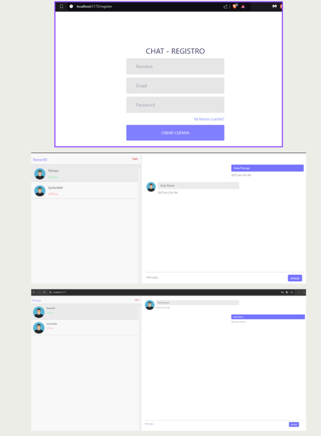

## Desarrollo FullStack | Elaboración de una Aplicación de Chat en Tiempo Real (React | JavaScript | CSS | Tailwind | Node JS | Express)

### Descripción

ChatApp es una aplicación de chat que permite la comunicación en tiempo real entre usuarios, utilizando tecnologías modernas para proporcionar una experiencia interactiva y fluida.

### Frontend

React con Tailwind CSS, gestionando rutas con React Router y comunicación en tiempo real con Socket.IO.

### Backend

Node.js con Express, utilizando Socket.IO para la comunicación en tiempo real y Nodemon para un desarrollo más eficiente.

### Funcionalidades Principales:

- **Login:** Acceso seguro para los usuarios.
- **Interfaz de Usuario:** Muestra el nombre del usuario y la lista de usuarios conectados.
- **Mensajes en Tiempo Real:** Envío y recepción instantánea de mensajes.
- **Historial de Mensajes:** Sección que lista todos los mensajes del chat seleccionado.

### Modelos Implementados:

- **Auth:** Configuración y gestión de la autenticación de usuarios.
- **Chat:** Manejo del estado del chat y mensajes.
- **Sockets:** Comunicación en tiempo real entre el cliente y el servidor.
